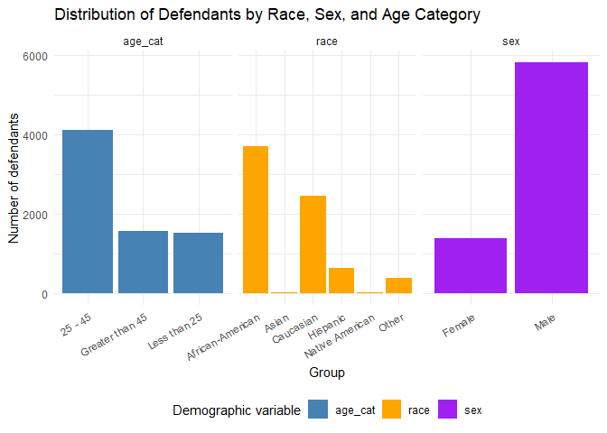
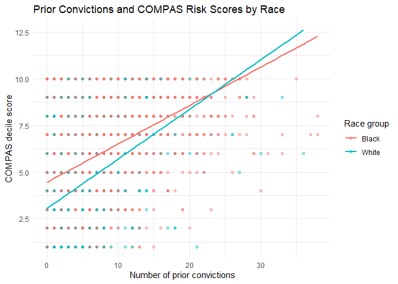

Lab 09: Algorithmic Bias
================
Tsion

## Load Packages and Data

First, let’s load the necessary packages:

``` r
library(tidyverse)
library(fairness)
library(janitor)
```

### The data

``` r
# Load the COMPAS data
compas <- read_csv("data/compas-scores-2-years.csv") %>%
  clean_names() %>%
  rename(
    decile_score = decile_score_12,
    priors_count = priors_count_15
  )
```

    ## New names:
    ## Rows: 7214 Columns: 53
    ## ── Column specification
    ## ──────────────────────────────────────────────────────── Delimiter: "," chr
    ## (19): name, first, last, sex, age_cat, race, c_case_number, c_charge_de... dbl
    ## (19): id, age, juv_fel_count, decile_score...12, juv_misd_count, juv_ot... lgl
    ## (1): violent_recid dttm (2): c_jail_in, c_jail_out date (12):
    ## compas_screening_date, dob, c_offense_date, c_arrest_date, r_offe...
    ## ℹ Use `spec()` to retrieve the full column specification for this data. ℹ
    ## Specify the column types or set `show_col_types = FALSE` to quiet this message.
    ## • `decile_score` -> `decile_score...12`
    ## • `priors_count` -> `priors_count...15`
    ## • `decile_score` -> `decile_score...40`
    ## • `priors_count` -> `priors_count...49`

``` r
# Take a look at the data
glimpse(compas)
```

    ## Rows: 7,214
    ## Columns: 53
    ## $ id                      <dbl> 1, 3, 4, 5, 6, 7, 8, 9, 10, 13, 14, 15, 16, 18…
    ## $ name                    <chr> "miguel hernandez", "kevon dixon", "ed philo",…
    ## $ first                   <chr> "miguel", "kevon", "ed", "marcu", "bouthy", "m…
    ## $ last                    <chr> "hernandez", "dixon", "philo", "brown", "pierr…
    ## $ compas_screening_date   <date> 2013-08-14, 2013-01-27, 2013-04-14, 2013-01-1…
    ## $ sex                     <chr> "Male", "Male", "Male", "Male", "Male", "Male"…
    ## $ dob                     <date> 1947-04-18, 1982-01-22, 1991-05-14, 1993-01-2…
    ## $ age                     <dbl> 69, 34, 24, 23, 43, 44, 41, 43, 39, 21, 27, 23…
    ## $ age_cat                 <chr> "Greater than 45", "25 - 45", "Less than 25", …
    ## $ race                    <chr> "Other", "African-American", "African-American…
    ## $ juv_fel_count           <dbl> 0, 0, 0, 0, 0, 0, 0, 0, 0, 0, 0, 0, 0, 0, 0, 0…
    ## $ decile_score            <dbl> 1, 3, 4, 8, 1, 1, 6, 4, 1, 3, 4, 6, 1, 4, 1, 3…
    ## $ juv_misd_count          <dbl> 0, 0, 0, 1, 0, 0, 0, 0, 0, 0, 0, 0, 0, 0, 0, 0…
    ## $ juv_other_count         <dbl> 0, 0, 1, 0, 0, 0, 0, 0, 0, 0, 0, 0, 0, 0, 0, 0…
    ## $ priors_count            <dbl> 0, 0, 4, 1, 2, 0, 14, 3, 0, 1, 0, 3, 0, 0, 1, …
    ## $ days_b_screening_arrest <dbl> -1, -1, -1, NA, NA, 0, -1, -1, -1, 428, -1, 0,…
    ## $ c_jail_in               <dttm> 2013-08-13 06:03:42, 2013-01-26 03:45:27, 201…
    ## $ c_jail_out              <dttm> 2013-08-14 05:41:20, 2013-02-05 05:36:53, 201…
    ## $ c_case_number           <chr> "13011352CF10A", "13001275CF10A", "13005330CF1…
    ## $ c_offense_date          <date> 2013-08-13, 2013-01-26, 2013-04-13, 2013-01-1…
    ## $ c_arrest_date           <date> NA, NA, NA, NA, 2013-01-09, NA, NA, 2013-08-2…
    ## $ c_days_from_compas      <dbl> 1, 1, 1, 1, 76, 0, 1, 1, 1, 308, 1, 0, 0, 1, 4…
    ## $ c_charge_degree         <chr> "F", "F", "F", "F", "F", "M", "F", "F", "M", "…
    ## $ c_charge_desc           <chr> "Aggravated Assault w/Firearm", "Felony Batter…
    ## $ is_recid                <dbl> 0, 1, 1, 0, 0, 0, 1, 0, 0, 1, 0, 1, 0, 0, 1, 1…
    ## $ r_case_number           <chr> NA, "13009779CF10A", "13011511MM10A", NA, NA, …
    ## $ r_charge_degree         <chr> NA, "(F3)", "(M1)", NA, NA, NA, "(F2)", NA, NA…
    ## $ r_days_from_arrest      <dbl> NA, NA, 0, NA, NA, NA, 0, NA, NA, 0, NA, NA, N…
    ## $ r_offense_date          <date> NA, 2013-07-05, 2013-06-16, NA, NA, NA, 2014-…
    ## $ r_charge_desc           <chr> NA, "Felony Battery (Dom Strang)", "Driving Un…
    ## $ r_jail_in               <date> NA, NA, 2013-06-16, NA, NA, NA, 2014-03-31, N…
    ## $ r_jail_out              <date> NA, NA, 2013-06-16, NA, NA, NA, 2014-04-18, N…
    ## $ violent_recid           <lgl> NA, NA, NA, NA, NA, NA, NA, NA, NA, NA, NA, NA…
    ## $ is_violent_recid        <dbl> 0, 1, 0, 0, 0, 0, 0, 0, 0, 1, 0, 0, 0, 0, 0, 0…
    ## $ vr_case_number          <chr> NA, "13009779CF10A", NA, NA, NA, NA, NA, NA, N…
    ## $ vr_charge_degree        <chr> NA, "(F3)", NA, NA, NA, NA, NA, NA, NA, "(F2)"…
    ## $ vr_offense_date         <date> NA, 2013-07-05, NA, NA, NA, NA, NA, NA, NA, 2…
    ## $ vr_charge_desc          <chr> NA, "Felony Battery (Dom Strang)", NA, NA, NA,…
    ## $ type_of_assessment      <chr> "Risk of Recidivism", "Risk of Recidivism", "R…
    ## $ decile_score_40         <dbl> 1, 3, 4, 8, 1, 1, 6, 4, 1, 3, 4, 6, 1, 4, 1, 3…
    ## $ score_text              <chr> "Low", "Low", "Low", "High", "Low", "Low", "Me…
    ## $ screening_date          <date> 2013-08-14, 2013-01-27, 2013-04-14, 2013-01-1…
    ## $ v_type_of_assessment    <chr> "Risk of Violence", "Risk of Violence", "Risk …
    ## $ v_decile_score          <dbl> 1, 1, 3, 6, 1, 1, 2, 3, 1, 5, 4, 4, 1, 2, 1, 2…
    ## $ v_score_text            <chr> "Low", "Low", "Low", "Medium", "Low", "Low", "…
    ## $ v_screening_date        <date> 2013-08-14, 2013-01-27, 2013-04-14, 2013-01-1…
    ## $ in_custody              <date> 2014-07-07, 2013-01-26, 2013-06-16, NA, NA, 2…
    ## $ out_custody             <date> 2014-07-14, 2013-02-05, 2013-06-16, NA, NA, 2…
    ## $ priors_count_49         <dbl> 0, 0, 4, 1, 2, 0, 14, 3, 0, 1, 0, 3, 0, 0, 1, …
    ## $ start                   <dbl> 0, 9, 0, 0, 0, 1, 5, 0, 2, 0, 0, 4, 1, 0, 0, 0…
    ## $ end                     <dbl> 327, 159, 63, 1174, 1102, 853, 40, 265, 747, 4…
    ## $ event                   <dbl> 0, 1, 0, 0, 0, 0, 1, 0, 0, 1, 0, 1, 0, 0, 1, 1…
    ## $ two_year_recid          <dbl> 0, 1, 1, 0, 0, 0, 1, 0, 0, 1, 0, 1, 0, 0, 1, 1…

# Part 1: Exploring the data

## Exercise 1

``` r
nrow(compas)
```

    ## [1] 7214

``` r
ncol(compas)
```

    ## [1] 53

The COMPAS dataset has 7214 rows and 53 columns. Each row represents one
defendant. The variables include information about the defendant, such
as race, sex, age, prior offenses, current charge, COMPAS risk score,
and whether the person recidivated within two years.

In my opinion, this dataset is important to examine carefully because
each row represents a real person, not just a number. Since the data are
connected to criminal justice decisions, mistakes in the algorithm could
have serious consequences.

### Exercise 2

``` r
n_distinct(compas$id)
```

    ## [1] 7214

``` r
nrow(compas)
```

    ## [1] 7214

As we can see, there are 7214 unique defendants in the dataset, compared
to 7214 total number of rows.

### Exercise 3

``` r
 ggplot(compas, aes(x = decile_score)) +
  geom_bar() +
  scale_x_continuous(breaks = 1:10) +
  labs(
    title = "Distribution of COMPAS Risk Scores",
    x = "COMPAS decile score",
    y = "Number of defendants"
  ) +
  theme_minimal()
```

<!-- -->

The distribution of COMPAS decile scores is right-skewed. Most
defendants received lower risk scores, especially a score of 1, and the
number of defendants generally decreases as the score gets higher.

In my opinion, this suggests that the dataset has more people classified
as lower risk than higher risk, although there are still defendants
across the full range from 1 to 10.

### Exercise 4

``` r
ggplot(compas, aes(x = race)) +
  geom_bar() +
  labs(
    title = "Distribution of Defendants by Race",
    x = "Race",
    y = "Number of defendants"
  ) +
  theme_minimal() +
  theme(axis.text.x = element_text(angle = 30, hjust = 1))
```

<!-- -->

``` r
ggplot(compas, aes(x = sex)) +
  geom_bar() +
  labs(
    title = "Distribution of Defendants by Sex",
    x = "Sex",
    y = "Number of defendants"
  ) +
  theme_minimal()
```

<!-- -->

``` r
ggplot(compas, aes(x = age_cat)) +
  geom_bar() +
  labs(
    title = "Distribution of Defendants by Age Category",
    x = "Age category",
    y = "Number of defendants"
  ) +
  theme_minimal()
```

<!-- -->

### Extra Challenge

``` r
compas_demographics <- compas %>%
  select(race, sex, age_cat) %>%
  pivot_longer(
    cols = everything(),
    names_to = "demographic_variable",
    values_to = "group"
  )
ggplot(compas_demographics, aes(x = group, fill = demographic_variable)) +
  geom_bar() +
  facet_wrap(~ demographic_variable, scales = "free_x") +
   scale_fill_manual(
    values = c(
      "age_cat" = "steelblue",
      "race" = "orange",
      "sex" = "purple"
    )
  ) +
   labs(
    title = "Distribution of Defendants by Race, Sex, and Age Category",
    x = "Group",
    y = "Number of defendants", 
    fill = "Demographic variable"
  ) +
  theme_minimal() +
  theme(
    axis.text.x = element_text(angle = 30, hjust = 1),
    legend.position = "bottom"
  )
```

<!-- -->

### Part 2: Risk scores and recidivism

### Exercise 5

``` r
# Calculate the recidivism rate for each COMPAS risk score
score_recid <- compas %>%
  group_by(decile_score) %>%
  summarize(
    n = n(),
    recid_rate = mean(two_year_recid == 1, na.rm = TRUE),
    .groups = "drop"
  )

score_recid
```

    ## # A tibble: 10 × 3
    ##    decile_score     n recid_rate
    ##           <dbl> <int>      <dbl>
    ##  1            1  1440      0.214
    ##  2            2   941      0.311
    ##  3            3   747      0.376
    ##  4            4   769      0.434
    ##  5            5   681      0.479
    ##  6            6   641      0.559
    ##  7            7   592      0.591
    ##  8            8   512      0.684
    ##  9            9   508      0.699
    ## 10           10   383      0.773

``` r
# Visualize the relationship between COMPAS score and actual recidivism
ggplot(score_recid, aes(x = decile_score, y = recid_rate)) +
  geom_col() +
  scale_x_continuous(breaks = 1:10) +
  scale_y_continuous(labels = scales::percent) +
  labs(
    title = "Actual Recidivism Rate by COMPAS Risk Score",
    x = "COMPAS decile score",
    y = "Percent who recidivated within two years"
  ) +
  theme_minimal()
```

<!-- -->

The higher risk scores do seem to correspond to higher rates of
recidivism. The graph shows a clear upward pattern: defendants with low
COMPAS scores, like 1 or 2, had much lower recidivism rates, while
defendants with high scores, like 9 or 10, had much higher recidivism
rates.

I think this suggests that the COMPAS score is capturing some real
relationship with recidivism risk, although this does not mean the
algorithm is perfectly fair or equally accurate for every group.

``` r
# Classify defendants as high risk, low risk, or medium
# Then check whether the prediction was correct
compas_classified <- compas %>%
  mutate(
    risk_group = case_when(
      decile_score >= 7 ~ "High risk",
      decile_score <= 4 ~ "Low risk",
      TRUE ~ "Medium risk"
    ),
    prediction_correct = case_when(
      risk_group == "High risk" & two_year_recid == 1 ~ TRUE,
      risk_group == "Low risk" & two_year_recid == 0 ~ TRUE,
      risk_group == "High risk" & two_year_recid == 0 ~ FALSE,
      risk_group == "Low risk" & two_year_recid == 1 ~ FALSE,
      TRUE ~ NA
    )
  )

# Look at the classifications
compas_classified %>%
  count(risk_group, prediction_correct)
```

    ## # A tibble: 5 × 3
    ##   risk_group  prediction_correct     n
    ##   <chr>       <lgl>              <int>
    ## 1 High risk   FALSE                644
    ## 2 High risk   TRUE                1351
    ## 3 Low risk    FALSE               1216
    ## 4 Low risk    TRUE                2681
    ## 5 Medium risk NA                  1322

We can see here that, for the high-risk group, COMPAS was correct for
1,351 defendants and incorrect for 644 defendants. For the low-risk
group, COMPAS was correct for 2,681 defendants and incorrect for 1,216
defendants. The medium-risk group has `NA` for `prediction_correct`
because we only defined predictions as clearly high risk or low risk, so
the medium-risk scores were not counted as correct or incorrect.

In my opinion, the model is correct more often than it is incorrect for
both the high-risk and low-risk groups. However, there are still a lot
of incorrect predictions, especially in the low-risk group. This matters
because a wrong prediction could affect how a defendant is treated in
the criminal justice system.

Here is the classification:

- True positives: 1,351

- False positives: 644 defendants

- True negatives: 2,681 defendants

- False negatives: 1,216 defendants

``` r
# We now Calculate the overall accuracy using only high-risk and low-risk classifications
overall_accuracy <- compas_classified %>%
  filter(!is.na(prediction_correct)) %>%
  summarize(
    accuracy = mean(prediction_correct, na.rm = TRUE)
  )

overall_accuracy
```

    ## # A tibble: 1 × 1
    ##   accuracy
    ##      <dbl>
    ## 1    0.684

Oh wait, the overall accuracy is 68%. This is not so great after all.

### Part 3: Investigating disparities

### Exercise 8

``` r
# Let's only keep Black and white defendants for this part of the analysis
compas_bw <- compas %>%
  filter(race %in% c("African-American", "Caucasian")) %>%
  mutate(
    race_group = case_when(
      race == "African-American" ~ "Black",
      race == "Caucasian" ~ "White"
    )
  )

# Check the filtered data
compas_bw %>%
  count(race_group)
```

    ## # A tibble: 2 × 2
    ##   race_group     n
    ##   <chr>      <int>
    ## 1 Black       3696
    ## 2 White       2454

``` r
# Compare COMPAS risk score distributions for Black and white defendants
ggplot(compas_bw, aes(x = decile_score, fill = race_group)) +
  geom_bar(position = "dodge") +
  scale_x_continuous(breaks = 1:10) +
  labs(
    title = "COMPAS Risk Scores by Race",
    x = "COMPAS decile score",
    y = "Number of defendants",
    fill = "Race group"
  ) +
  theme_minimal()
```

<!-- -->

There are more Black defendants than white defendants in the data: 3,696
Black defendants compared with 2,454 white defendants.

The bar chart also shows that the white defendants are more concentrated
in the lower risk scores, especially score 1. Black defendants appear
more evenly spread across the scores and have higher counts in the
higher risk categories, especially scores 6 through 10.

In my opinion, this is important because it suggests that Black
defendants were assigned higher COMPAS risk scores more often than white
defendants. This does not automatically prove bias by itself, but it
does show why we need to look more closely at error rates and fairness
across race groups.

``` r
# Calculate the percentage of Black and white defendants classified as high risk
high_risk_by_race <- compas_bw %>%
  group_by(race_group) %>%
  summarize(
    n = n(),
    high_risk_n = sum(decile_score >= 7, na.rm = TRUE),
    high_risk_percent = mean(decile_score >= 7, na.rm = TRUE),
    .groups = "drop"
  )

high_risk_by_race
```

    ## # A tibble: 2 × 4
    ##   race_group     n high_risk_n high_risk_percent
    ##   <chr>      <int>       <int>             <dbl>
    ## 1 Black       3696        1425             0.386
    ## 2 White       2454         419             0.171

``` r
# Plot the percentage classified as high risk by race
ggplot(high_risk_by_race, aes(x = race_group, y = high_risk_percent, fill = race_group)) +
  geom_col() +
  scale_y_continuous(labels = scales::percent) +
  labs(
    title = "Percentage Classified as High Risk by Race",
    x = "Race group",
    y = "Percent classified as high risk"
  ) +
  theme_minimal() +
  theme(legend.position = "none")
```

<!-- -->

There is certainly a disparity!

### Exercise 10

``` r
# Calculate false positive and false negative rates by race
error_rates <- compas_bw %>%
  group_by(race_group) %>%
  summarize(
    false_positive_rate = mean(decile_score >= 7 & two_year_recid == 0, na.rm = TRUE) /
      mean(two_year_recid == 0, na.rm = TRUE),
    
    false_negative_rate = mean(decile_score <= 4 & two_year_recid == 1, na.rm = TRUE) /
      mean(two_year_recid == 1, na.rm = TRUE),
    
    .groups = "drop"
  )

error_rates
```

    ## # A tibble: 2 × 3
    ##   race_group false_positive_rate false_negative_rate
    ##   <chr>                    <dbl>               <dbl>
    ## 1 Black                   0.249                0.280
    ## 2 White                   0.0914               0.477

The false positive rate is higher for Black defendants than for white
defendants. For Black defendants, the false positive rate is about
24.9%, while for white defendants it is about 9.1%. This means Black
defendants who did not recidivate were more likely to be classified as
high risk.

The false negative rate is higher for white defendants than for Black
defendants. For white defendants, the false negative rate is about
47.7%, while for Black defendants it is about 28.0%. This means white
defendants who did recidivate were more likely to be classified as low
risk.

I think this might be one of the most important findings in the lab (at
least for me). The model does not make the same kinds of errors for both
race groups. It seems more likely to over-classify Black defendants as
high risk and more likely to under-classify white defendants as low
risk. Quite interesting? It looks like the errors are not distributed
equally across racial groups?

### Exercise 11

``` r
# Change the error-rate table into long format for plotting
error_rates_long <- error_rates %>%
  pivot_longer(
    cols = c(false_positive_rate, false_negative_rate),
    names_to = "metric",
    values_to = "rate"
  ) %>%
  mutate(
    metric = case_when(
      metric == "false_positive_rate" ~ "False positive rate",
      metric == "false_negative_rate" ~ "False negative rate"
    )
  )

error_rates_long
```

    ## # A tibble: 4 × 3
    ##   race_group metric                rate
    ##   <chr>      <chr>                <dbl>
    ## 1 Black      False positive rate 0.249 
    ## 2 Black      False negative rate 0.280 
    ## 3 White      False positive rate 0.0914
    ## 4 White      False negative rate 0.477

``` r
# Compare false positive and false negative rates between Black and white defendants
ggplot(error_rates_long, aes(x = metric, y = rate, fill = race_group)) +
  geom_col(position = "dodge") +
  scale_y_continuous(labels = scales::percent) +
  labs(
    title = "False Positive and False Negative Rates by Race",
    x = "Error type",
    y = "Rate",
    fill = "Race group"
  ) +
  theme_minimal()
```

<!-- -->

The plot shows a clear disparity in the types of errors made for Black
and white defendants. Black defendants have a much higher false positive
rate, about 24.9%, compared with about 9.1% for white defendants. This
means Black defendants who did not recidivate were more likely to be
incorrectly classified as high risk.

White defendants have a higher false negative rate, about 47.7%,
compared with about 28.0% for Black defendants. This means white
defendants who did recidivate were more likely to be incorrectly
classified as low risk.

I chose this style of plot because a bar chart makes it easy to compare
the two error rates across the two race groups. In my opinion, putting
the false positive rate and false negative rate in the same
visualization makes the tradeoff easier to see: the model is not making
errors equally across groups, and the direction of the error differs by
race. This has been very interesting as it unfolds for sure!

### Part 4: Understanding the sources of bias

### Exercise 12

``` r
# Look at the relationship between prior convictions and COMPAS risk score by race
compas %>%
  filter(race %in% c("African-American", "Caucasian")) %>%
  mutate(
    race_group = recode(
      race,
      "African-American" = "Black",
      "Caucasian" = "White"
    )
  ) %>%
  ggplot(aes(x = priors_count, y = decile_score, color = race_group)) +
  geom_point(alpha = 0.4) +
  geom_smooth(method = "lm", se = FALSE) +
  labs(
    title = "Prior Convictions and COMPAS Risk Scores by Race",
    x = "Number of prior convictions",
    y = "COMPAS decile score",
    color = "Race group"
  ) +
  theme_minimal()
```

    ## `geom_smooth()` using formula = 'y ~ x'

<!-- -->

The plot shows that COMPAS risk scores generally increase as the number
of prior convictions increases. This makes sense because prior
convictions are likely related to the risk score.

However, the trend lines suggest that Black defendants tend to receive
higher COMPAS scores than white defendants when the number of prior
convictions is low, especially around zero prior convictions. I believe
this suggests that prior convictions alone do not fully explain the
differences in COMPAS scores by race. The algorithm may be using other
variables that contribute to different scores across racial groups.

### Exercise 13

``` r
# Check calibration:
calibration <- compas_bw %>%
  group_by(race_group, decile_score) %>%
  summarize(
    n = n(),
    recid_rate = mean(two_year_recid == 1, na.rm = TRUE),
    .groups = "drop"
  )

calibration
```

    ## # A tibble: 20 × 4
    ##    race_group decile_score     n recid_rate
    ##    <chr>             <dbl> <int>      <dbl>
    ##  1 Black                 1   398      0.229
    ##  2 Black                 2   393      0.303
    ##  3 Black                 3   346      0.419
    ##  4 Black                 4   385      0.460
    ##  5 Black                 5   365      0.482
    ##  6 Black                 6   384      0.560
    ##  7 Black                 7   400      0.592
    ##  8 Black                 8   359      0.682
    ##  9 Black                 9   380      0.708
    ## 10 Black                10   286      0.794
    ## 11 White                 1   681      0.209
    ## 12 White                 2   361      0.313
    ## 13 White                 3   273      0.341
    ## 14 White                 4   285      0.396
    ## 15 White                 5   241      0.461
    ## 16 White                 6   194      0.572
    ## 17 White                 7   143      0.615
    ## 18 White                 8   114      0.719
    ## 19 White                 9    98      0.694
    ## 20 White                10    64      0.703

Based on the calibration table, I do see some evidence supporting
Northpointe’s claim that the algorithm is calibrated. For both Black and
white defendants, higher COMPAS scores generally correspond to higher
actual recidivism rates. For example, people with low scores like 1 or 2
have lower recidivism rates, while people with high scores like 8, 9, or
10 have much higher recidivism rates. The recidivism rates are also
fairly similar across race groups for many of the same score levels.

But, I still am not convinced that this means the algorithm is
completely fair. We saw earlier that the false positive rate was much
higher for Black defendants, while the false negative rate was higher
for white defendants. So the algorithm may be calibrated in one sense,
but still produce unequal error rates across racial groups?

### Part 5: Designing fairer algorithms

### Exercise 14

If I were creating a fairer risk assessment algorithm, here are some
changes I would make.

First, I would test the algorithm separately across racial groups
instead of only reporting one overall accuracy number.

Second, I would try to make the model more transparent so people can
understand what variables are being used and how they affect the score.

I also think the algorithm should be regularly audited with new data. A
model that seems fair at one point in time might become less fair later
if policing patterns, sentencing practices, or population
characteristics change.

### Exercise 15

One major trade off is between accuracy and fairness. A model might be
more accurate overall but still produce unfair error rates for different
groups.

Another trade-off is between false positives and false negatives.
Reducing false positives may increase false negatives, and reducing
false negatives may increase false positives.

### Exercise 16

This was a bit of a hard one to think about! Policy changes are needed
to make sure risk assessment tools are used fairly. Iam not very sure
about how it actually is. But I think courts should not rely only on an
algorithmic score when making decisions about a person. The score should
be one piece of information, not the final decision-maker. Theree should
also be transparency about how the algorithm works, what data it uses,
and how accurate it is for different groups. The people involved should
also be able to challenge or question the use of these scores.
